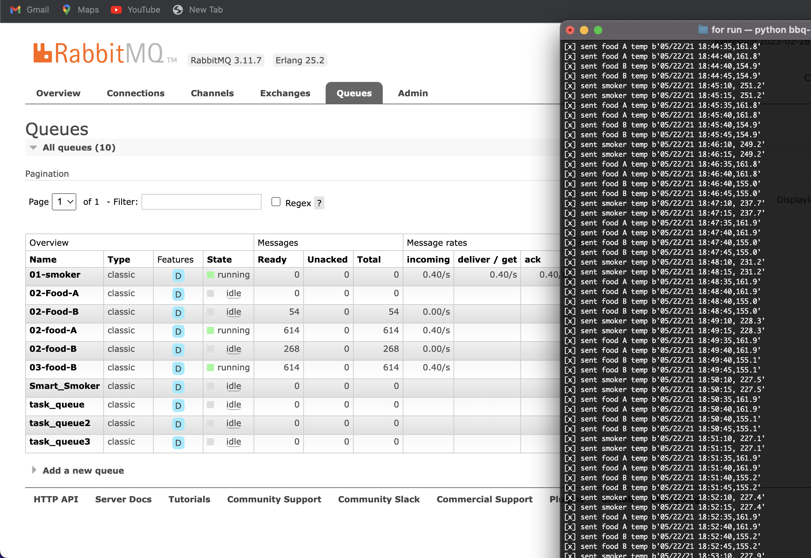
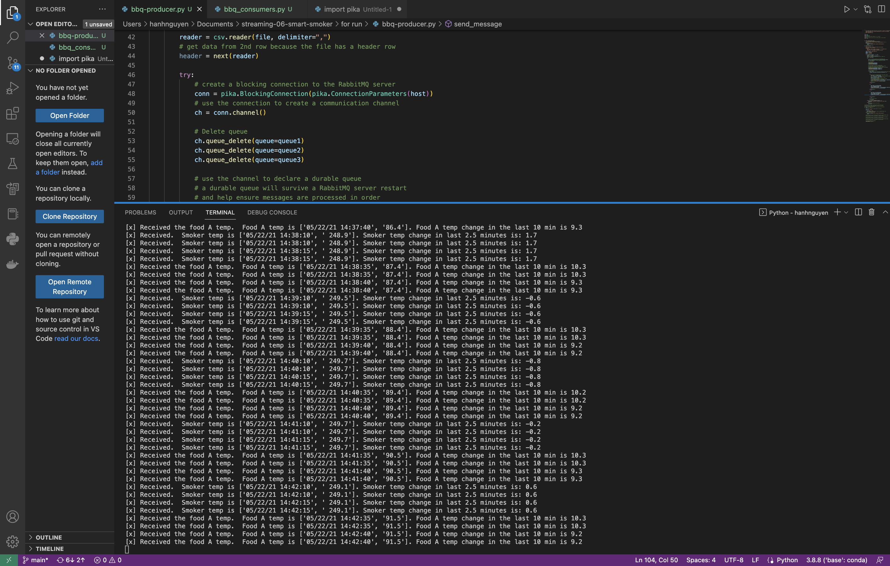
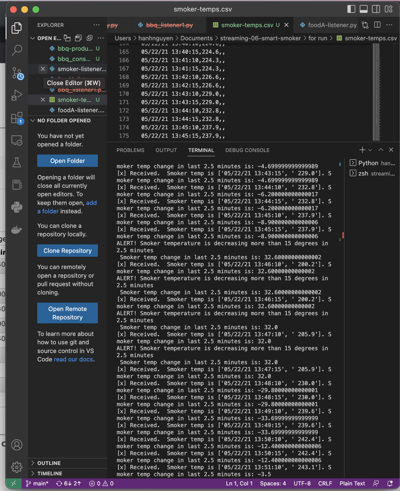

# streaming-06-smart-smoker
## Design and Implement a producer for the Smart Smoker App. Add a consumer for the Smart Smoker App.

Name: Hanh Nguyen

Using a Barbeque Smoker When running a barbeque smoker, we monitor the temperatures of the smoker and the food to ensure the temp  stay where we set. If not, alert messages will be sent to alert.

### Sensors
 We have temperature sensors track temperatures and record them to generate a history of both (a) the smoker and (b) the food over time. These readings are an example of time-series data, and are considered streaming data or data in motion.

Streaming Data Our thermometer records three temperatures every thirty seconds (two readings every minute). The three temperatures are:

the temperature of the smoker itself. the temperature of the first of two foods, Food A. the temperature for the second of two foods, Food B. Smart System We will use Python to:

Simulate a streaming series of temperature readings from our smart smoker and two foods. Create a producer to send these temperature readings to RabbitMQ. Create three consumer processes, each one monitoring one of the temperature streams. Perform calculations to determine if a significant event has occurred. We want to stream information from a smart smoker. Read one value every half minute. (sleep_secs = 30)

### smoker-temps.csv has 4 columns:

* [0] Time = Date-time stamp for the sensor reading 
* [1] Channel1 = Smoker Temp --> send to message queue "01-smoker" 
* [2] Channe2 = Food A Temp --> send to message queue "02-food-A" 
* [3] Channe3 = Food B Temp --> send to message queue "03-food-B"

Significant Events We want know if:

* The smoker temperature decreases by more than 15 degrees F in 2.5 minutes (smoker alert!)
Any food temperature changes less than 1 degree F in 10 minutes (food stall!)
 
* The timestamps are offset, and many intervals have missing data. For school, we will make some simplifying assumptions and focus on the overall process.

* Simplifying assumptions For class, assume each data point with a value occurs on a regular basis and add it to the deque.

That is:

* IGNORE the real timestamps evaluate the deque of readings (either 5 or 20) as though the real timestamps were not so terrible. It's more complex if we try to use real timestamps. Adjusting for the non-regular timestamps is an interesting problem, but not the point. Know that you will likely have to address issues like that in the "real world".

### Producer (bbq_producer.py)

The producer opens the csv file, smoker-temps.csv, and reads each row. For each row, a connection is made to Rabbit MQ, queues are declared, each columns is read and submitted to its respective queue. For each column, the time is captured, then the temp, sending both to the queue as a row. If there is no temp then no message is sent to that queue.
  

### Consumer (bbq_consumers.py)
 The consumer created to establishe a connection with RabbitMQ, declares the queue, then starts consuming the messages from the three queues through the callback functions. The callbacks have a deque that are processing a defined number of messages, representing the last number of defined minutes. The temp from the messages are analyzed to determine if there is cause for alarm. If not, information is simply reported.
 All callbacks are in one consumer script. However, the third callback (for food B) does not seem to work. The alert messages were not printed out as expected.
  
### Consumer (smoker-listener.py)
 The consumer created to test if the alert messages were printed out. 
 
